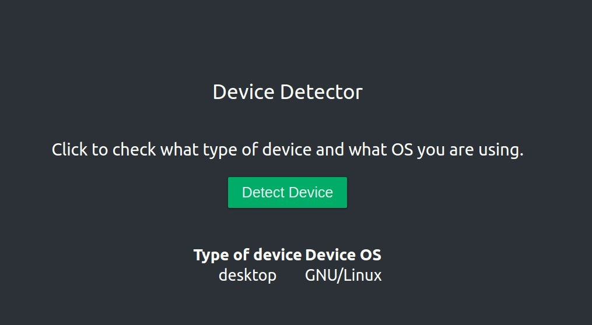

# Device Detection

This project was bootstrapped with [Create React App](https://github.com/facebook/create-react-app).

## Available Scripts

In the project directory, you can run:

### `npm install`

Install all requirements.

### `npm start`

Runs the app in the development mode. 
Open [http://localhost:3000](http://localhost:3000) to view it in the browser.

The page will reload if you make edits. 
You will also see any lint errors in the console.

### `npm test`

Launches the test runner in the interactive watch mode. 
See the section about [running tests](https://facebook.github.io/create-react-app/docs/running-tests) for more information.

## Docker
    To build the container use:
        docker build --file /Dockerfile -t frontend .

    To run it:
        docker run --rm -p 5000:5000 frontend

### Compose

    Docker compose can be used to run both, the API and the frontend.
        docker-compose up --build

## ENV

    .env file has the value of the API URL set by default to http://localhost:8080/api
